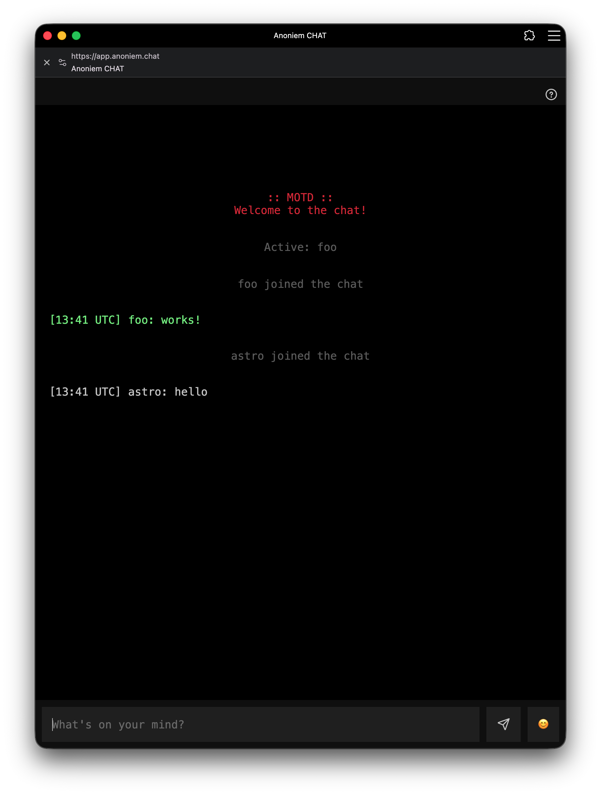

# Anoniem Chat

**Anoniem Chat** is a high-security, privacy-focused, and ephemeral group messaging platform. It is designed for users who require absolute anonymity with zero data retention and end-to-end encryption (E2EE).



## Core Pillars

- **Zero Persistence:** No databases, no logs of message content, and no tracking. Everything exists only in volatile memory (RAM) and is wiped upon reload.
- **End-to-End Encryption (E2EE):** All messages are encrypted in the browser using **AES-GCM 256** before being sent to the server. The server acts as a blind relay and never has access to encryption keys or plaintext.
- **Privacy by Design:** No registration, no cookies, no analytics, and no fingerprinting.
- **Room Isolation:** Messages are scoped to 64-character Room IDs. Only users with the same Room ID and Encryption Key can communicate.

## Features

- **Anonymous Identities:** No sign-up required. Choose a nickname or change it anytime.
- **Slash Commands:**
  - `/nick <newname>` — Change your display name.
  - `/who` — List active participants in the current room.
  - `/id` — Display your current username and room hash.
  - `/motd` — View the current Message of the Day.
  - `/clear` — Wipe the local chat history.
- **PWA Support:** Installable as a mobile or desktop app for a native experience.
- **Anti-Spam & Security:** Built-in rate limiting, connection throttling (IP-based), and automated strike system for abusive behavior.
- **Responsive Design:** Optimized for both mobile and desktop browsers with a clean, distraction-free UI.

## Technical Stack

- **Backend:** Node.js, Express (v5+), Socket.io.
- **Frontend:** Vanilla JS, Socket.io-client, Web Crypto API (for E2EE).
- **Logging:** Pino (structured, high-performance logging).
- **Compression:** Gzip/Brotli via Express compression middleware.

## Development & Deployment

### Prerequisites
- Node.js (Latest LTS recommended)
- `npm`

### Local Setup
1. Clone the repository.
2. Install dependencies:
   ```bash
   npm install
   ```
3. Configure environment variables (optional):
   - Copy `.env` if provided or create one with `MAX_GLOBAL_USERS`, `ONLINE_TOKEN`, etc.
4. Start the server:
   ```bash
   # Using the start script (requires zsh)
   ./00-STARTSERVER
   
   # Or directly with node
   node server.js
   ```

### Production Notes
The server is configured to run behind a reverse proxy (like Nginx). Ensure your proxy handles SSL/TLS termination and passes the correct headers (e.g., `X-Forwarded-For`) for rate limiting to function correctly.

## License
MIT License — © 2026 mmcvuur
